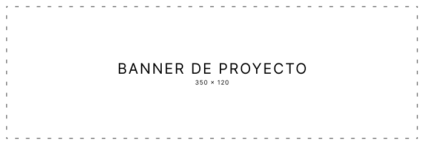

# **REST API Setup**

    

Este es un setup de configuración y montaje de integración REST API, apto para el desarollo de proyectos backend.

## **Guía de Instalación**

## **Configuración de Variables de Entorno**

## **Iniciar Servidor**

## **Tópicos**

Conoce otros aspectos internos del proyecto en este repositorio:

✨ **[Convención de Commits](./CONVENTIONAL_COMMITS.md)**

✨ **[Esquema de Versionamiento](./VERSIONING_SCHEME.md)**

✨ **[Instrucciones de Montaje]()**

---
© 2024 Cistem Innovación ® | Casa de Software. All Rights Reserved. Soluciones de Cistem Innovación ® Casa de Software.